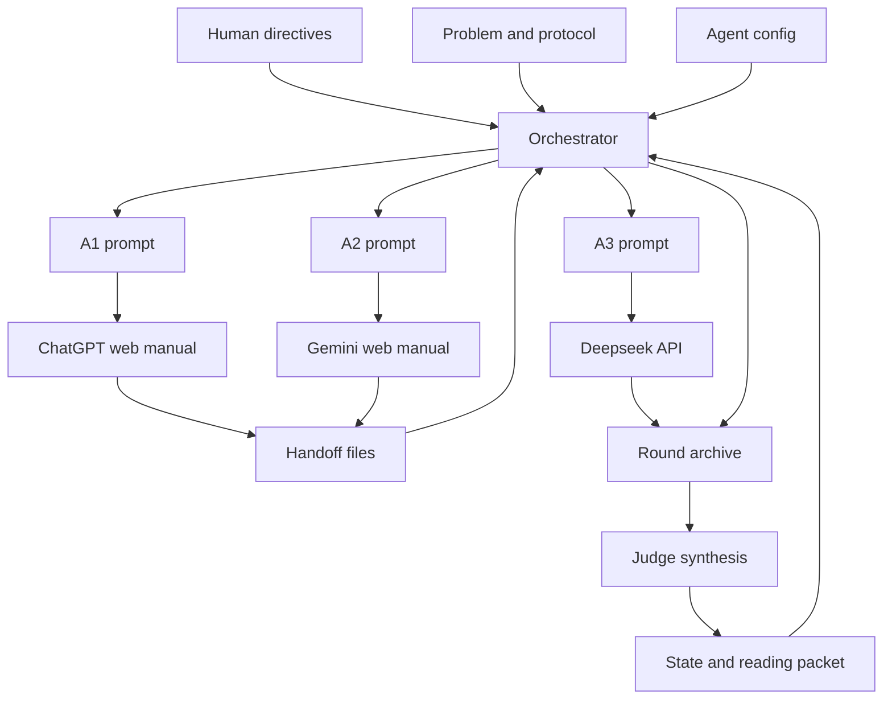
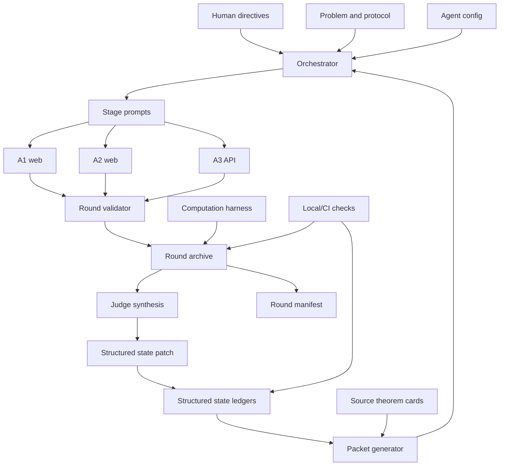

# Math Problem-Solving Workflow Report: Gauss Circle Project

Generated: 2026-06-25

This report summarizes the current architecture and workflow used in the Gauss circle problem project, based on the repository files in `D:\BaiduSyncdisk\Codex\gauss circle`. It also identifies practical improvements to make the workflow more reliable, auditable, and scalable for long mathematical research runs.

## Executive Summary

The project is a file-based, public-memory workflow for collaborative mathematical research. It adapts the KKT-style multi-agent collaboration pattern to the Gauss circle problem and uses four active agents:

- `A1`: ChatGPT Extended Pro through the web UI.
- `A2`: Gemini Pro Deep Think through the web UI.
- `A3`: Deepseek V4 Pro through an API-compatible endpoint.
- `A4`: Claude Max Thinking through the web UI.

The workflow is organized around strict research rounds. Each round has independent reasoning, cross-review, judge synthesis, and state update stages. The public repository is the authoritative memory; persistent web conversations are useful for continuity but are not treated as authoritative.

The current mathematical route is the balanced arithmetic hyperbola/Vaaler route:

```text
P(X)=N(sqrt(X))-pi X
  -> symmetric hyperbola identity
  -> floor-compatible sawtooth formula
  -> finite Vaaler expansion
  -> fixed-coefficient reciprocal main sums
```

The current proof state is conservative. The project has a conditional bridge:

```text
H1-H3 + H4 + R5-Full + M9 => P(X) <<_epsilon X^(1/4+epsilon)
```

The analytic bottleneck remains `M9`, the endpoint-strength estimate for fixed-Vaaler-coefficient reciprocal sums. No new Gauss circle exponent has been proved.

## Repository Architecture

### Main Artifact Types

The repository is organized as a durable research archive:

```text
problems/
  gauss_circle.md

protocol.md
README.md

config/
  agents.web-test.json
  agents.example.json

math_collab/
  orchestrator.py
  human.py
  normalize_markdown.py
  api_smoke.py

state/
  current_state.md
  lemma_bank.md
  gap_register.md
  best_proof_draft.md

human/
  current_directives.md
  goals.md
  ideas.md
  references.md
  inbox/

manifests/
  reading_packet.md

rounds/
  web-research-test/
    round_001/
    ...
    round_028/

handoff/
  web-research-test/
```

The distinction between `rounds/` and `handoff/` is important:

- `rounds/` is the public archive of prompts, responses, reviews, judge syntheses, human notes, and audits.
- `handoff/` is temporary, ignored by Git, and used to move copied web responses from A1/A2/A4 into the orchestrator.

### Agent Configuration

The active configuration is `config/agents.web-test.json`.

The config defines:

- active agents and legacy aliases;
- provider type, either `web_manual` or `openai_compatible`;
- model or endpoint metadata;
- stage-specific behavior contracts;
- quality gates for API outputs;
- prompt exclusions for inactive agents such as Qwen;
- A1 as the default judge.

The roles are intentionally asymmetric:

- `A1` is the strategist, synthesis writer, literature scout, and default judge.
- `A2` is the conservative referee and obstruction finder, with strict long-form formula-level requirements.
- `A3` is the API proof auditor, algebra checker, normalization checker, and executable-test planner.
- `A4` is the narrow analytic proof-surgeon for focused M9 sublemmas and dependency calibration.

This gives the workflow four complementary failure modes and strengths: synthesis, adversarial conservatism, automated audit, and narrow proof surgery.

### Orchestrator

`math_collab/orchestrator.py` is the core automation layer. It:

1. Loads the problem, protocol, state files, human directives, and agent config.
2. Builds agent-specific prompts.
3. Writes prompt files into `rounds/<run-id>/round_XXX/prompts/`.
4. For manual web agents, creates or reads handoff files under `handoff/<run-id>/round_XXX/`.
5. For API agents, calls the configured OpenAI-compatible endpoint.
6. Enforces stage barriers unless `--allow-partial` is used.
7. Writes API/manual outputs into the public round archive.
8. Updates `state/current_state.md` and `manifests/reading_packet.md` after judge synthesis.
9. Optionally commits and pushes round changes.

The barrier synchronization is central:

```text
Stage A reasoning must finish for A1/A2/A3/A4
  before Stage B reviews start.

Stage B reviews must finish for A1/A2/A3/A4
  before Stage C judge synthesis starts.

Stage C judge synthesis must finish
  before Stage D state update starts.

Stage D must finish
  before the next round should begin.
```

### Human Steering

Human input is injected through:

- `human/current_directives.md`
- `human/goals.md`
- `human/ideas.md`
- `human/references.md`
- `human/inbox/*.md`
- round-local files such as `rounds/<run-id>/round_XXX/human/*.md`

`math_collab/human.py` can add structured notes and optionally activate them into `current_directives.md`.

Human instructions override previous AI suggestions when they change the target, add a reference, reject a route, introduce a constraint, or change the success criterion.

### Manual Web Workflow

A1, A2, and A4 are semi-manual web agents. The normal workflow is:

1. The orchestrator generates prompt files.
2. The user pastes the A1 prompt into the persistent ChatGPT conversation.
3. The user pastes the A2 prompt into the persistent Gemini conversation.
4. The user pastes the A4 prompt into the persistent Claude conversation.
5. The user copies each web response as Markdown.
6. The copied response is saved into the correct `handoff/` file.
7. The orchestrator normalizes and archives it into `rounds/`.

Helper scripts support this:

- `scripts/paste_web_prompt.ps1`
- `scripts/paste_review_prompts.ps1`
- `scripts/save_clipboard_response.ps1`
- `scripts/watch_web_research_run.ps1`

The watcher script is the main operational tool. It repeatedly runs the orchestrator, reports which files are missing, normalizes copied Markdown, and advances the round when barriers are satisfied.

### API Workflow

A3 is automatic when `DEEPSEEK_API_KEY` is configured. The config uses an OpenAI-compatible endpoint:

```text
https://api.deepseek.com/chat/completions
```

The A3 role is deliberately restricted:

- no invented citations;
- no web-search claims;
- exact algebra checks;
- theorem-hypothesis audits;
- normalization checks;
- reproducible verification plans.

If the API key is missing and `--skip-missing-api` is used, the orchestrator writes a pending marker instead of failing.

## Round Workflow

### Stage A: Independent Reasoning

Each agent receives:

- the problem statement;
- active agents;
- protocol;
- current reading packet and state;
- human steering bundle;
- previous judge-assigned task for that agent;
- agent-specific mode and depth contract.

Expected output includes:

- summary;
- main claim or direction;
- detailed reasoning;
- theorem-dependency audit;
- hidden assumptions and gaps;
- counterexample or obstruction search;
- verification;
- divergent alternatives;
- useful lemmas;
- next tests;
- confidence.

### Stage B: Cross Review

Each agent reviews the other active agents' Stage A outputs.

Expected output includes:

- valuable input from others;
- claims that look correct;
- claims needing proof;
- possible errors or hidden assumptions;
- suggested synthesis;
- research strategy;
- verification;
- score table;
- next-round recommendation;
- confidence.

### Stage C: Judge Synthesis

A1 reads all reasoning and review outputs, then writes:

- selected main route;
- useful fragments by source;
- rejected or risky ideas;
- known gaps;
- new lemmas to add;
- counterexample checks;
- research strategy adjustment;
- next-round prompts for A1/A2/A3/A4;
- confidence.

The next-round prompt sections are machine-important: the orchestrator extracts `For A1`, `For A2`, `For A3`, and `For A4` blocks and injects them into the next Stage A prompt.

### Stage D: State Update

The orchestrator appends the judge synthesis to `state/current_state.md` and regenerates `manifests/reading_packet.md`.

The intended state files are:

- `current_state.md`: compact current research state;
- `lemma_bank.md`: proposed, proved, conditional, and rejected lemmas;
- `gap_register.md`: known gaps and failure points;
- `best_proof_draft.md`: best current proof skeleton;
- `reading_packet.md`: compact packet for the next round.

In the current repository, `current_state.md` and `reading_packet.md` carry most of the real state. `lemma_bank.md` and `gap_register.md` are present but not yet being updated with the same fidelity.

## Current Mathematical Workflow

### Problem Target

The project uses:

```text
N(R) = #{(m,n) in Z^2 : m^2+n^2 <= R^2}
N(R) = pi R^2 + E(R)
```

With `X=R^2`, the target becomes:

```text
P(X)=N(sqrt(X))-pi X <<_epsilon X^(1/4+epsilon)
```

The workflow is not allowed to claim a solution unless all reductions, endpoint conventions, smoothing or unsmoothing steps, and external theorem hypotheses are supplied.

### Main Route

The current selected route is:

1. Use the arithmetic identity behind the representation function `r_2(n)`.
2. Apply a symmetric Dirichlet hyperbola decomposition.
3. Convert floor terms into a floor-compatible sawtooth function.
4. Apply finite Vaaler approximation after balancing the hyperbola range.
5. Separate residual terms from main terms.
6. Control the Fejer residual using product-counting (`R5-Full`).
7. Reduce the remaining endpoint problem to fixed-coefficient reciprocal main sums (`M9`).

The accepted high-level reduction is:

```text
H1-H3: arithmetic/hyperbola/sawtooth infrastructure
H4: finite Vaaler approximation
R5-Full: Fejer residual product-count control
M9: open endpoint estimate for fixed main sums
```

### Current Bottleneck

`M9` remains the active open analytic target. It asks for endpoint-strength bounds for the fixed-coefficient sums:

```text
M1(D;X), M2(D;X) <<_epsilon X^(1/4+epsilon)
```

uniformly over active dyadic denominator blocks:

```text
X^(1/4) <= D <= X^(1/2)
```

The second sum, `M2`, is especially important because its coefficient structure carries the frequency-side character factor:

```text
C_h = e(h/4)-e(3h/4)
```

and requires careful two-sided conventions.

### Current Round Status

At the time of this report:

- Round 27 is complete and contains responses, reviews, judge synthesis, human notes, and audits.
- Round 28 has generated A1/A2/A3/A4 reasoning prompts in the current four-agent workflow.
- Round 28 has an A3 response archived at `rounds/web-research-test/round_028/responses/A3-028.md`.
- Round 28 is still waiting for web-agent reasoning responses before reviews can begin.

Round 28's intended purpose is an execution-and-taxonomy round:

- A1 should maintain the conservative proof draft and state packet.
- A2 should complete the `M2` fourth-moment taxonomy and near-collision formulation.
- A3 should execute source checks and computational diagnostics instead of producing only protocol-level plans.
- A4 should focus on narrow analytic proof surgery for selected M9 sublemmas.

## Strengths of the Current Workflow

### 1. Durable Public Memory

The repository acts as the canonical memory. This is essential because web conversations are long, stateful, and hard to audit. Archiving prompts, responses, reviews, and judge syntheses makes the research path reconstructable.

### 2. Strict Stage Barriers

The barrier design prevents premature synthesis. Reviews cannot start until every reasoning output is present, and judging cannot start until every review is present. This reduces the chance that one agent's early conclusion dominates the round before other views are available.

### 3. Asymmetric Agent Roles

The workflow does not use interchangeable models. It assigns complementary responsibilities:

- A1 synthesizes and manages research direction.
- A2 slows the process down with conservative referee behavior.
- A3 audits algebra and executable verification details.
- A4 performs narrow proof surgery and dependency calibration.

This division is well matched to mathematical research, where false closure is a major risk.

### 4. Strong Claim-Status Discipline

The protocol repeatedly forces separation between:

- proved claims;
- proposed claims;
- conditional claims;
- hidden assumptions;
- theorem dependencies;
- numerical checks;
- rejected routes.

This is exactly the right safety habit for a hard open problem.

### 5. Human Override Channel

The `human/` files give the user a clear way to steer the process without rewriting the automation. This is valuable for injecting references, correcting priorities, or imposing higher standards.

### 6. Iterative Judge-Driven Prompting

The judge synthesis creates agent-specific next-round tasks. This gives the workflow memory and direction while still preserving independent reasoning in the next round.

## Current Weaknesses and Risks

### 1. State Bloat

The current prompt files are very large, around 1.5 MB for Round 28 reasoning prompts. This suggests that `current_state.md` and `reading_packet.md` have grown from compact state into a near-complete transcript.

Risks:

- high token cost;
- slower web UI handling;
- lower model attention to the newest task;
- stale instructions re-entering prompts;
- harder human review.

### 2. State Is Not Fully Structured

`lemma_bank.md` and `gap_register.md` are present but not carrying the real updated lemma/gap state. Most of that information is appended into `current_state.md` and regenerated into `reading_packet.md`.

Risks:

- lemmas are hard to query;
- gap status is hard to audit;
- promotion from proposed to proved is informal;
- state updates depend too heavily on judge prose.

### 3. Manual Web Handoff Is Fragile

A1, A2, and A4 depend on copying Markdown from web UIs into files.

Risks:

- accidental paste into wrong file;
- corrupted math formatting;
- missing outer code fences;
- incomplete copied responses;
- web conversation drift;
- manual latency.

### 4. Web-Agent Quality Gates Are Mostly Prompt-Enforced

A2 has strong depth contracts, but manual web outputs are not automatically validated the way A3 outputs are.

Risks:

- a response can silently omit required sections;
- word-count or status-label requirements may fail;
- inactive-agent mentions can reappear;
- finality/overclaim language may slip through.

### 5. A3 Execution Gap

Round 27 explicitly notes that A3 still needs to produce actual committed tables or scripts, not just protocol-level checklists. Round 28's A3 response is a strong audit memo, but the repository still needs a reproducible computation harness and outputs.

Risks:

- computational verification remains aspirational;
- numerical claims cannot be reproduced;
- exact rational/high-precision edge cases remain untested.

### 6. Source Audit Is Still Partly Manual

The workflow correctly avoids black-box use of Li-Yang and Vaaler, but rendered-page source checks remain pending in places.

Risks:

- theorem labels and equations may be mis-copied from TeX or memory;
- external theorem hypotheses may be applied outside their range;
- source status may remain ambiguous across rounds.

### 7. Round Completion Status Is Implicit

The watcher reports missing files, but there is no single committed round manifest that records:

- stage status;
- file hashes;
- model/mode used;
- timestamps;
- manual/API provenance;
- state-update status;
- commit/push status.

Risks:

- hard to inspect a run without recomputing file presence;
- hard to detect stale handoff files;
- hard to compare public archive against local handoff state.

## Improvement Recommendations

### Priority 1: Split State Into Structured Ledgers

Add machine-readable or semi-structured files:

```text
state/claims.yml
state/lemmas.yml
state/gaps.yml
state/routes.yml
state/tasks.yml
state/sources.yml
```

Each item should include:

- stable ID;
- title;
- status;
- exact statement;
- dependencies;
- evidence files;
- last round updated;
- owner agent;
- next verification action.

Recommended statuses:

```text
proposed
derived_under_assumptions
proved_internal
proved_external_dependency
conditional
diagnostic_only
rejected
open
blocked
```

This would let the reading packet be generated from structured state instead of long appended prose.

### Priority 2: Make `reading_packet.md` Truly Compact

Replace the current full-history packet with a layered packet:

1. One-page current research summary.
2. Current route and bottleneck.
3. Active lemmas with statuses.
4. Active gaps.
5. Current round task.
6. Source theorem cards.
7. Links to prior round files instead of pasted history.

Keep full history in `rounds/`, not inside every prompt.

Target prompt size should be measured and capped. A good operational target is:

```text
core prompt context <= 80k-150k characters
agent-specific task <= 10k characters
```

Large prior outputs should be referenced by file path and summarized, not re-included unless the stage specifically requires them.

### Priority 3: Automate State Extraction From Judge Output

Add a state update parser that extracts:

- new lemmas;
- rejected ideas;
- known gaps;
- next-round tasks;
- source dependencies;
- confidence notes.

Instead of appending the entire judge synthesis to `current_state.md`, the parser should update structured ledgers and create a compact human-readable diff.

The judge prompt should require machine-readable blocks, for example:

````markdown
## State Patch
```yaml
lemmas:
  - id: R5-Full-R27
    status: conditional
    depends_on: [H4-R27]
gaps:
  - id: M9
    status: open
```
````

### Priority 4: Add Round Manifests

Each round should have:

```text
rounds/<run-id>/round_XXX/manifest.json
```

Suggested fields:

- run ID and round number;
- stage status;
- agent IDs and display names;
- model/mode metadata;
- prompt file paths and hashes;
- response file paths and hashes;
- review file paths and hashes;
- judge file path and hash;
- handoff source file path if applicable;
- timestamps;
- quality-gate status;
- state update timestamp;
- commit hash when published.

This makes a round self-describing and easier to audit.

### Priority 5: Add Automated Validation for Manual Web Outputs

Create a checker such as:

```powershell
python -m math_collab.validate_round --run-id web-research-test --round 28
```

It should check:

- all required files exist;
- no placeholder markers remain;
- required headings are present;
- minimum word count and heading count;
- no inactive agent labels;
- no unsupported status labels;
- Markdown math uses `$...$` and `$$...$$`;
- copied output does not contain outer web artifacts;
- A2 includes its required calibration marker;
- judge includes `For A1`, `For A2`, `For A3`, and `For A4`.

This would convert prompt-enforced expectations into repository-enforced expectations.

### Priority 6: Build the A3 Computational Harness

Create a dedicated computation package:

```text
computations/
  README.md
  r5_residual/
  m9_regression/
  cauchy_kernel/
  fourth_moment_bins/
  near_collision/
  li_yang_audit/
  outputs/
```

Each experiment should include:

- exact command;
- input parameters;
- precision settings;
- random seed if applicable;
- output table;
- summary Markdown;
- validation checks.

For the current math state, the first executable targets should be:

1. R5 residual tables.
2. Raw-vs-paired M9 regression.
3. Complex-weight failure test.
4. Fixed-coefficient stress comparison.
5. M2 Cauchy kernel diagnostics.
6. CRI endpoint ratios.

Use exact integer arithmetic where possible and high precision near Fejer resonances.

### Priority 7: Create Source Theorem Cards

Add:

```text
sources/
  vaaler_1985.md
  li_yang_2023.md
  huxley_2003.md
  bourgain_watt.md
```

Each card should include:

- bibliographic data;
- local file path or URL;
- exact theorem statement;
- equation/page anchors;
- hypotheses;
- conclusion;
- whether the theorem is used, only compared, or rejected for current purposes;
- round where audited.

This would prevent repeated partial source audits and reduce citation drift.

### Priority 8: Add CI or Local Checks

Add a simple GitHub Actions or local check script that runs:

- dry-run orchestrator smoke test;
- round manifest validation;
- Markdown math lint;
- inactive-agent label scan;
- stale prompt exclusion scan;
- size check for reading packet and prompts;
- Python syntax checks.

This project is research-heavy, but basic CI would catch workflow regressions.

### Priority 9: Add Decision Records

Create:

```text
docs/decisions/
  ADR-001-three-agent-panel.md
  ADR-002-balanced-hyperbola-main-route.md
  ADR-003-fixed-coefficient-M9-target.md
  ADR-004-reading-packet-compaction.md
```

Each decision record should state:

- context;
- decision;
- rejected alternatives;
- consequences;
- date and round.

This would make strategic pivots easier to remember without forcing every prompt to include the whole story.

### Priority 10: Separate Research Tracks

The current single round loop carries several distinct kinds of work. Split them into explicit tracks:

```text
Track A: proof infrastructure
Track B: M9 analytic attack
Track C: computation and falsification
Track D: source/literature audit
Track E: workflow/tooling maintenance
```

Each round can still use A1/A2/A3/A4, but the judge should assign tasks by track. This avoids mixing proof-draft maintenance, theorem hunting, computation plans, and narrow proof surgery into one overloaded prompt.

## Suggested Near-Term Action Plan

### Next Round Actions

1. Complete Round 28 Stage A by collecting the web-agent reasoning outputs.
2. Run Stage B cross-review only after A1/A2/A3/A4 reasoning outputs are present.
3. In the Round 28 judge synthesis, require a structured state patch.
4. Do not accept protocol-only A3 output as sufficient for the execution track.
5. Make A3's next deliverable a script plus at least one small reproducible table.

### Next Tooling Actions

1. Add `rounds/<run-id>/round_XXX/manifest.json`.
2. Add `math_collab.validate_round`.
3. Add `state/claims.yml`, `state/gaps.yml`, and `state/tasks.yml`.
4. Regenerate `manifests/reading_packet.md` from the structured state.
5. Add a prompt-size budget warning to the orchestrator.

### Next Mathematical Documentation Actions

1. Move active lemma statuses out of `current_state.md` into `state/lemmas.yml`.
2. Write source theorem cards for Vaaler and Li-Yang.
3. Update `best_proof_draft.md` with the conditional bridge and current M9 convention.
4. Preserve `M9` as open and do not promote CRI/fourth-moment/Hardy-collapse diagnostics without theorem-level implications.

## Proposed Future Architecture

The current architecture is:



The improved architecture should be:



The main change is that prose remains readable, but the authoritative state becomes structured and validated.

## Conclusion

The current workflow is already strong for exploratory mathematical research: it has durable memory, stage barriers, asymmetric agent roles, conservative claim discipline, and a clear judge-led iteration loop.

The biggest architectural issue is not the research logic; it is state management. The project has outgrown append-only Markdown state. Moving to structured ledgers, compact generated packets, round manifests, automatic validation, and executable computation harnesses would make the workflow much more robust.

Mathematically, the workflow should keep the current conservative stance. The balanced hyperbola/Vaaler route is the active framework, `R5-Full` appears to control the fixed Fejer residual conditional on Vaaler, and `M9` remains the real open analytic bottleneck. The next meaningful progress should be either a theorem-level attack on `M9` or reproducible computations that clarify which parts of `M9` are plausible, fragile, or misleading.
